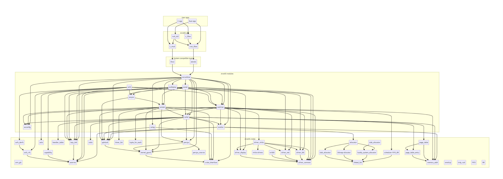

## Rustdoc

* https://rcore-os.github.io/arceos/

## ChaOS Modules

* [axalloc](https://github.com/bosswnx/chaos/tree/main/modules/axalloc): ArceOS 全局内存分配器。
* [axconfig](https://github.com/bosswnx/chaos/tree/main/modules/axconfig): 各个平台的对应常量和参数.
* [axdisplay](https://github.com/bosswnx/chaos/tree/main/modules/axdisplay): ArceOS 图像模块.
* [axdriver](https://github.com/bosswnx/chaos/tree/main/modules/axdriver): ArceOS d设备驱动.
* [axfs](https://github.com/bosswnx/chaos/tree/main/modules/axfs): ArceOS 文件系统模块.
* [axhal](https://github.com/bosswnx/chaos/tree/main/modules/axhal): ArceOS 硬件抽象层, 为各个平台的专有操作提供一致的API.
* [axlog](https://github.com/bosswnx/chaos/tree/main/modules/axlog): ArceOS 使用的多级日志输出宏.
* [axnet](https://github.com/bosswnx/chaos/tree/main/modules/axnet): ArceOS 网络模块.
* [axruntime](https://github.com/bosswnx/chaos/tree/main/modules/axruntime): 运行时库 of ArceOS.
* [axsync](https://github.com/bosswnx/chaos/tree/main/modules/axsync): ArceOS 同步原语.
* [axtask](https://github.com/bosswnx/chaos/tree/main/modules/axtask): ArceOS 任务管理器模块.

## Crates

* [allocator](https://github.com/bosswnx/chaos/tree/main/crates/allocator): 在统一的接口下提供多种分配器算法.
* [arm_gic](https://github.com/bosswnx/chaos/tree/main/crates/arm_gic): ARM通用中断控制器（Generic Interrupt Controller，简称GIC）寄存器定义和基本操作.
* [axerrno](https://github.com/bosswnx/chaos/tree/main/crates/axerrno): 错误码定义 used by ArceOS.
* [axfs_devfs](https://github.com/bosswnx/chaos/tree/main/crates/axfs_devfs): 设备文件系统 used by ArceOS.
* [axfs_vfs](https://github.com/bosswnx/chaos/tree/main/crates/axfs_vfs): 虚拟文件接口 used by ArceOS.
* [axio](https://github.com/bosswnx/chaos/tree/main/crates/axio): 为`no_std`环境提供的类`std::io`的traits.
* [capability](https://github.com/bosswnx/chaos/tree/main/crates/capability): 提供基本的基于能力的安全性.
* [crate_interface](https://github.com/bosswnx/chaos/tree/main/crates/crate_interface): 提供在一个 crate 中定义接口（trait）的方式，但可以在任何 crate 中实现或使用该接口。
* [driver_block](https://github.com/bosswnx/chaos/tree/main/crates/driver_block): 块存储驱动程序的通用 trait 和类型.
* [driver_common](https://github.com/bosswnx/chaos/tree/main/crates/driver_common): 设备驱动接口 used by ArceOS.
* [driver_display](https://github.com/bosswnx/chaos/tree/main/crates/driver_display): 图形设备驱动程序的通用 trait 和类型.
* [driver_net](https://github.com/bosswnx/chaos/tree/main/crates/driver_net):网络设备驱动程序的通用 trait 和类型.
* [driver_pci](https://github.com/bosswnx/chaos/tree/main/crates/driver_pci): 用于 PCI 总线操作的结构和函数.
* [driver_virtio](https://github.com/bosswnx/chaos/tree/main/crates/driver_virtio): 在 virtio-drivers crate 中封装了一些设备，并实现了 driver_common 系列 crate 中的 traits.
* [flatten_objects](https://github.com/bosswnx/chaos/tree/main/crates/flatten_objects): 一个存储编号对象的容器。每个对象可以分配一个唯一的ID.
* [handler_table](https://github.com/bosswnx/chaos/tree/main/crates/handler_table): 一个无锁（lock-free）的事件处理程序表. 
* [kernel_guard](https://github.com/bosswnx/chaos/tree/main/crates/kernel_guard): 用于创建临界区的RAII封装器，其中本地中断或抢占被禁用. 
* [lazy_init](https://github.com/bosswnx/chaos/tree/main/crates/lazy_init): 一个用于lazy_init值的封装器，没有并发安全性但更高效.
* [linked_list](https://github.com/bosswnx/chaos/tree/main/crates/linked_list): 支持O(1)随机删除的链表.
* [memory_addr](https://github.com/bosswnx/chaos/tree/main/crates/memory_addr): 虚地址和物理地址的封装和函数. 
* [page_table](https://github.com/bosswnx/chaos/tree/main/crates/page_table): 对于多种硬件结构的通用页表设计.
* [page_table_entry](https://github.com/bosswnx/chaos/tree/main/crates/page_table_entry): 对于多种硬件结构的页表项设计.
* [percpu](https://github.com/bosswnx/chaos/tree/main/crates/percpu): 定义和访问每个CPU核心的数据结构.
* [percpu_macros](https://github.com/bosswnx/chaos/tree/main/crates/percpu_macros): 用于定义和访问每个CPU核心的数据结构的宏.
* [ratio](https://github.com/bosswnx/chaos/tree/main/crates/ratio): 不同比例的类型及相关运算.
* [scheduler](https://github.com/bosswnx/chaos/tree/main/crates/scheduler): 统一接口下的多种调度算法.
* [slab_allocator](https://github.com/bosswnx/chaos/tree/main/crates/slab_allocator): 在 no_std 系统中使用的一个Slab分配器实现。它使用多个大小不同的内存块组成的内存池，并使用一个链表来管理大于 4096 字节的内存块。.
* [spinlock](https://github.com/bosswnx/chaos/tree/main/crates/spinlock): 在 no_std 环境中实现的自旋锁（spin lock），可以在获取锁时禁用内核本地中断（IRQs）或抢占.
* [timer_list](https://github.com/bosswnx/chaos/tree/main/crates/timer_list): 在计时器到期时触发的一系列定时事件列表，这些事件按顺序依次触发.
* [tuple_for_each](https://github.com/bosswnx/chaos/tree/main/crates/tuple_for_each): 提供了一些宏和方法，用于迭代访问元组结构体的字段.

## Applications (Rust)

| App | Extra modules | Enabled features | Description |
|-|-|-|-|
| [helloworld](https://github.com/bosswnx/chaos/tree/main/apps/helloworld/) | | | A minimal app that just prints a string |
| [exception](https://github.com/bosswnx/chaos/tree/main/apps/exception/) | | paging | Exception handling test |
| [memtest](https://github.com/bosswnx/chaos/tree/main/apps/memtest/) | axalloc | alloc, paging | Dynamic memory allocation test |
| [display](https://github.com/bosswnx/chaos/tree/main/apps/display/) | axalloc, axdisplay | alloc, paging, display | Graphic/GUI test |
| [yield](https://github.com/bosswnx/chaos/tree/main/apps/task/yield/) | axalloc, axtask | alloc, paging, multitask, sched_fifo | Multi-threaded yielding test |
| [parallel](https://github.com/bosswnx/chaos/tree/main/apps/task/parallel/) | axalloc, axtask | alloc, paging, multitask, sched_fifo, irq | Parallel computing test (to test synchronization & mutex) |
| [sleep](https://github.com/bosswnx/chaos/tree/main/apps/task/sleep/) | axalloc, axtask | alloc, paging, multitask, sched_fifo, irq | Thread sleeping test |
| [priority](https://github.com/bosswnx/chaos/tree/main/apps/task/priority/) | axalloc, axtask | alloc, paging, multitask, sched_cfs | Thread priority test |
| [shell](https://github.com/bosswnx/chaos/tree/main/apps/fs/shell/) | axalloc, axdriver, axfs | alloc, paging, fs | A simple shell that responds to filesystem operations |
| [httpclient](https://github.com/bosswnx/chaos/tree/main/apps/net/httpclient/) | axalloc, axdriver, axnet | alloc, paging, net | A simple client that sends an HTTP request and then prints the response |
| [echoserver](https://github.com/bosswnx/chaos/tree/main/apps/net/echoserver/) | axalloc, axdriver, axnet, axtask | alloc, paging, net, multitask | A multi-threaded TCP server that reverses messages sent by the client  |
| [httpserver](https://github.com/bosswnx/chaos/tree/main/apps/net/httpserver/) | axalloc, axdriver, axnet, axtask | alloc, paging, net, multitask | A multi-threaded HTTP server that serves a static web page |
| [udpserver](https://github.com/bosswnx/chaos/tree/main/apps/net/udpserver/) | axalloc, axdriver, axnet | alloc, paging, net | A simple echo server using UDP protocol |

## Applications (C)

| App | Extra modules | Enabled features | Description |
|-|-|-|-|
| [helloworld](https://github.com/bosswnx/chaos/tree/main/apps/c/helloworld/) | | | A minimal C app that just prints a string |
| [memtest](https://github.com/bosswnx/chaos/tree/main/apps/c/memtest/) | axalloc | alloc, paging | Dynamic memory allocation test in C |
| [sqlite3](https://github.com/bosswnx/chaos/tree/main/apps/c/sqlite3/) | axalloc, axdriver, axfs | alloc, paging, fp_simd, fs | Porting of [SQLite3](https://sqlite.org/index.html) |
| [iperf](https://github.com/bosswnx/chaos/tree/main/apps/c/iperf/) | axalloc, axdriver, axfs, axnet | alloc, paging, fp_simd, fs, net, select | Porting of [iPerf3](https://iperf.fr/) |
| [redis](https://github.com/bosswnx/chaos/tree/main/apps/c/redis/) | axalloc, axdriver, axtask, axfs, axnet | alloc, paging, fp_simd, irq, multitask, fs, net, pipe, epoll | Porting of [Redis](https://redis.io/) |

## Dependencies


graph TD;
subgraph "User Apps"
A["Rust App"]
C["C App"]
end
subgraph "ArceOS ulib"
B["rust_libax"]
D["c_libax"]
E("rust_std")
F("c_musl")
end
A --> B;
C --> D;
A --> E;
D --> B;
E --> B;
E --> F;
C --> F;
subgraph "System compatible layer"
G["aeceos"]
H("linux")
end
B --> G;
F --> H;
subgraph "ArceOS modules"
I[axruntime]
J[axlog]
K[axsync]
L[axhal]
M[axconfig]
N[axalloc]
O[axtask]
P[axdriver]
Q[axnet]
Q1[axdisplay]
M1[axfs]
end
G --> I;
H --> I;
I --> IN6;
I --> IN3;
I --> IN9;
I --> IN4;
I --> IN15;
I --> N;
I --> M;
I --> P;
I --> L;
I --> J;
I --> Q;
I --> Q1;
I --> O;
Q1 --> P;
Q1 --> IN4;
Q1 --> K;
Q1 --> T5;
P --> IN11;
P --> T0;
P --> T1;
P --> T2;
P --> T3;
P --> T5;
P --> N;
P --> L;
P --> M;
N --> IN9;
N --> IN5;
N --> R;
N --> IN13;
L --> M;
L --> N;
L --> IN3;
L --> IN9;
L --> IN8;
L --> IN4;
L --> P1;
L --> P11;
L --> IN6;
L --> IN5;
L --> IN2;
L --> IN15;
J --> IN9;
J --> IN15;
Q --> T0;
Q --> T2;
Q --> IN4;
Q --> IN13;
Q --> L;
Q --> K;
Q --> O;
Q --> P;
K --> IN9;
K --> O;
O --> L;
O --> M;
O --> IN6;
O --> IN9;
O --> IN4;
O --> IN5;
O --> S;
O --> IN10;
O --> IN3;
O --> IN15;
M1 --> IN4;
M1 --> F3;
M1 --> T0;
M1 --> T1;
M1 --> IN14;
M1 --> IN13;
M1 --> F1;
M1 --> F2;
M1 --> P;
M1 --> K;
subgraph "ArceOS crates"
R[allocator]
IN12[arm_gic]
IN13[axerrno]
F1[axfs_devfs]
F2[axfs_vfs]
IN14[axio]
F3[capability]
IN15[crate_interface]
T1[driver_blk]
T0[driver_common]
T5[driver_display]
T2[driver_net]
T3[driver_virtio]
IN2[handler_table]
IN3[kernel_guard]
IN4[lazy_init]
Z[linked_list]
IN5[memory_addr]
P1[page_table]
P11[page_table_entry]
IN6[percpu]
IN7[percpu_macros]
IN8[ratio]
S[scheduler-FIFO_RR]
IN1[slab_allocator]
IN9[spinlock]
IN10[timer_list]
IN11[tuple_for_each]
T4(e1000)
V(smoltcp)
W(lwip_rust)
OUT2(bitmap-allocator)
Y(slab_allocator)
S1(FIFO)
S2(RR)
OUT1(buddy_system_allocator)
OUT3(virtio-drivers)
end
R --> OUT1;
R --> OUT2;
R --> Y;
IN4 --> IN13;
S --> Z;
OUT1 --> Z;
OUT2 --> Z;
IN1 --> OUT1;
Y --> Z;
T3 --> T1;
T3 --> T2;
T3 --> T5;
T3 --> OUT3;
T3 --> T0;
T1 --> T0;
T2 --> T0;
T4 --> T0;
T5 --> T0;
IN3 --> IN15;
P1 --> IN5;
P1 --> P11;
P11 --> IN5;
IN6 --> IN3;
IN6 --> IN7;
IN9 --> IN3;
F3 --> IN13;
F2 --> IN13;
F1 --> F2;

